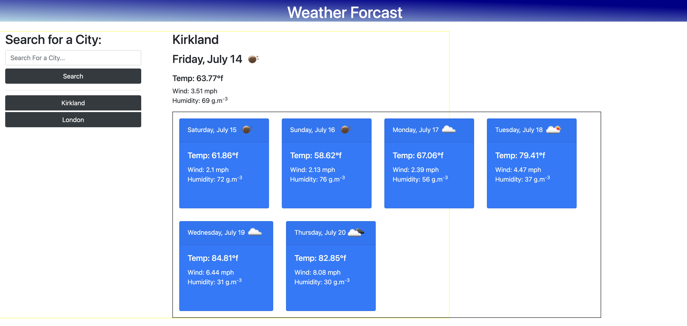

# Work-Day-Scheduler

## User Story

As a traveler, I want to see the weather outlook for multiple cities, so I can plan a trip accordingly

## Acceptance Criteria

GIVEN a weather dashboard with form inputs: 

- When I search for a city, I am presented with current and future conditions for that city and that city is added to the search history
- When I view current weather conditions for that city, I am presented with the city name, the date, an icon representation of weather conditions, the temperature, the humidity, and the wind speed
- When I view future weather conditions for that city, I am presented with a 5-day forecast that displays the date, an icon representation of weather conditions, the temperature, the wind speed, and the humidity
- When I click on a city in the search history, I am again presented with current and future conditions for that city

## Mock-Up

The following Image demonstrates the application functionality:

## Live Demo

A Live Demo Can be Found [Here](https://julianmlacey.github.io/Weather-Dashboard/)

## License

View "LICENSE" in Repository
